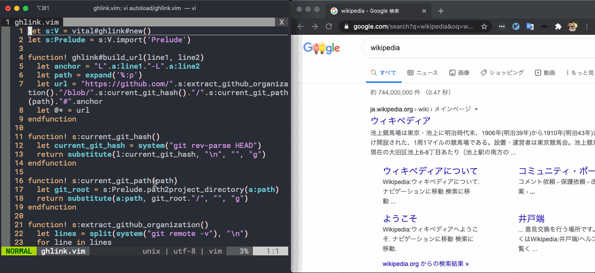

# ghlink.vim

ghlink.vim is a Vim plugin for get the GitHub link for the selected line.


### ＊ Warning
- Assuming the file exists remotely
- Although we plan to improve it in the future, we recommend using this plugin from the local master / main branch.


## Usage

```

1. Switch to VISUAL mode
2. Select the line
3. Type `:` followed by `Ghlink`
4. It's yanked, so open it in your browser
```

## Installation
e.g [vim-plug](https://github.com/junegunn/vim-plug)
```vim
Plug 'cat2koban/ghlink.vim'
```

## Author 
[cat2koban](https://github.com/cat2koban)
